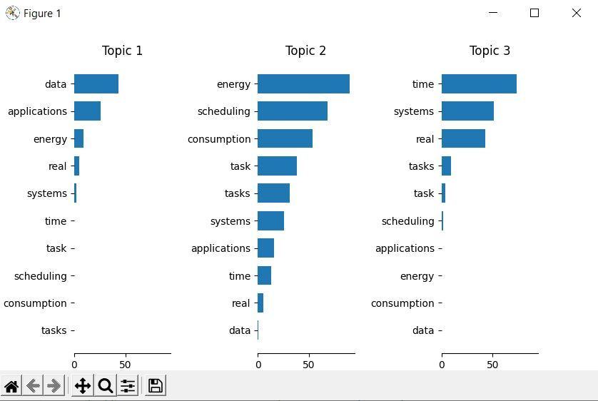

# topic-cluster

> Cluster papers into topics according to their titles and abstracts.

This program takes a Bibtex file and reads the titles and/or the
abstracts. After that a Latent Dirichlet Allocation is applied on those.
The result is shown as a bar graph. The idea of this is found in Teh et.
al.[^1]



## Installation

To run this program from the code directly, [`python`](https://www.python.org/) and [`poetry`](https://python-poetry.org/) (`pip install poetry`) are required.

To install all the dependencies, use your command line and navigate to the directory where this `README` file is located in. Then run

```bash
poetry install
```

## Execution

To execute the program use
```bash
poetry run python -m topic_cluster
```

The following arguments are supported:

``` bash
topic_cluster [-h] [--version] [-v] [-vv] [--ignore-last-bibtex-path] [-t TOPIC_COUNT] [-f FEATURE_COUNT] [--no-title] [--no-abstract] [--no-plot] [--no-feature-list] [bibtex_path]
```

**Positional optional arguments**

  - `bibtex_path`: The file path of the bibtex file to read, if not given, the path from
    the last call is used, if this is the first call, the program will ask for it via a
    file open dialog

**Optional arguments**

  - `-h`, `--help`:            Show this help message and exit
  - `--version`, `-V`:         Show the program's version number and exit
  - `-v`, `--verbose`:         Set the loglevel to INFO
  - `-vv`, `--very-verbose`:   Set the loglevel to DEBUG
  - `--ignore-last-bibtex-path`, `-i`:
                               Always ask for the bibtex path (and do not use the one
                               from the previous run) if the bibtex_path is not given
  - `-t TOPIC_COUNT`, `--topics TOPIC_COUNT`:
                               The number of topics, default is 3
  - `-f FEATURE_COUNT`, `--features FEATURE_COUNT`:
                               The number of features to per topic, default is 7
  - `--no-title`:              Use to exclude the title from the feature detection
  - `--no-abstract`:           Use to exclude the abstract from the feature detection
  - `--no-plot`:               Do not show the plot
  - `--no-feature-list`:       Do not show the feature-frequency list

If no `bibtex_path` is given, a dialog will ask for the bibtex path. The
topic and feature count will have the default values and title and
abstract are used.

The actual appearance of the graph depends on the backend used by
matplotlib.

To use natural language processing to refine search terms is called
"systematic reviews" which I found in Teh et. al.[^1]

[^1]: Teh, Hui Yie, Andreas W. Kempa-Liehr, und Kevin I-Kai Wang.
    "Sensor data quality: a systematic review". Journal of Big Data 7,
    Nr. 1 (11. Februar 2020): 11. <https://doi.org/10.1186/s40537-020-0285-1>.
